# 1) Instalace Windows serveru


Nastavení admin hesla Password1*

## Postup
### Specify Name nad Location
**Name**:
```
PS2-(váš login)-Win_server_2019  
````
**Lokace**: 
````
E:\PTPS\váš login\ 
````

### Specify Generation
````
Generation 2 
````

### Assign Memory 
````
4096 MB
````
"Dynamic memory" není potřeba zapíná, když je vypnutá nic to nezmění

### Configure Networking
````
Virtual switch nad I219V  
````

### Connect Virtual Hard Disk  
Vybereme, **Use an existing virtual hard disk** a uvedeme disk který nám byl poskytnut od učitele většinou se ukládá na **disk E**
````
E:\PS2\váš login\Win_server_2019\Virtual Hard Disks\ 
````

Když nebudeme mít disk *(což nepřepokládám)* tak můžeme vytvořit disk možností **Create a virtual hard disk** a uložíme na **disk E do své složky** a **dáme velikost 127 GB**. A v další sekci uvdeme cestu k ISO souboru co jsme dostali od učitele. 
````
E:\Hyper-V\Windows_server_2019.iso
````


---
# 2) Instalace Windows (klient)
Úplně to samé jako instalace serveru tady jsou pro případ možný specifikace kdyby se lišili
```
ISO uložit do E:\Hyper-V  
Založit složku E:\PTPS\váš login

Nainstalovat Windows Edu:  
name: PS2-(vaš login)-Win_Edu  
location: E:\PTPS\váš login  
Generation 1  
Memory: 4096  
Use Dynamic memory  
Connected: Virtual switch nad I219V  
Create virtual hard disk  
location: E:\PTPS\váš login\Win_Edu\Virtual Hard Disks\  
Size 127 GB (virtuální - pozor na realné místo na disku e:)  
Install an OS from bootable image:  
E:\Hyper-V\Windows_Edu.iso
```
---
# 3) Nastavení síťových karet
## Server
### Virtual switch síťová karta:
Statická IPv4 adresa:             **192.168.60.100+X/24**        **(X** je číslo tvého PC)
Gateway:                                **192.168.60.254**
DNS1:                                     **192.168.50.165**


### Internal síťová karta:
Statická IPv4 adresa:             10.100.0.1/16


## Stanice (klient) Windows 10
### Internal síťová karta:
Statická IPv4 adresa:             10.100.0.2/16

### MASKA
/8        >          255.255.0.0 -internal
/24      >          25.255.255.0 – virtual switch

---
# 4) Instalace AD včetně DNS – přidání uživatele ‘‘uživatel‘‘ do AD

## Přejmenování serveru
https://cdn.hostadvice.com/2022/04/how-to-change-hostname-or-server-name-in-windows-server-2022-2.png.webp
SERVER-XX (XX = číslo počítače)

## Instalace Active Directory (AD)
- **Server manager -> Manage (vlaječka) -> Add roles features -> doinstalovat AD a DNS**


**Nezapomenout na DNS**

## Nastavení AD

**Add a new forest**
A jako **Root domain name** nastavíme 
````
eitXX.vspj.cz (XX = číslo počítače)
````

## Přidaní uživatele
Active Directory Users and Computers > ad.vspj.eit >Users

Příklad vytváření uživatele:


## DNS
https://computingforgeeks.com/configure-dns-server-on-windows-server-2022/
# 5) Nasdílení složky (home)
Na disku C: vytvoříme složku "home"
Nasdílení složky  jako domovské složky pro účet ‘‘uzivatel‘‘, a nastavení práv RW jen pro tohoto uživatele *(na serveru)*
Při zapínaní sdílení přidat na konec symbol dolaru
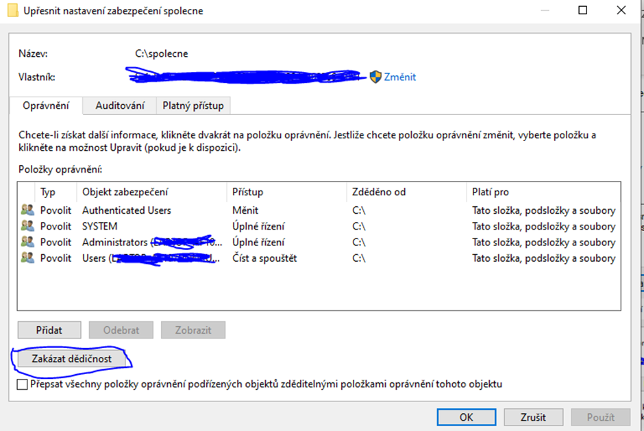
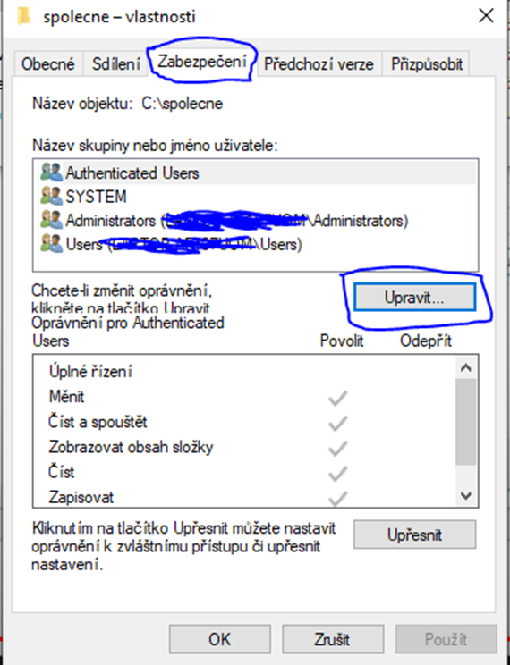
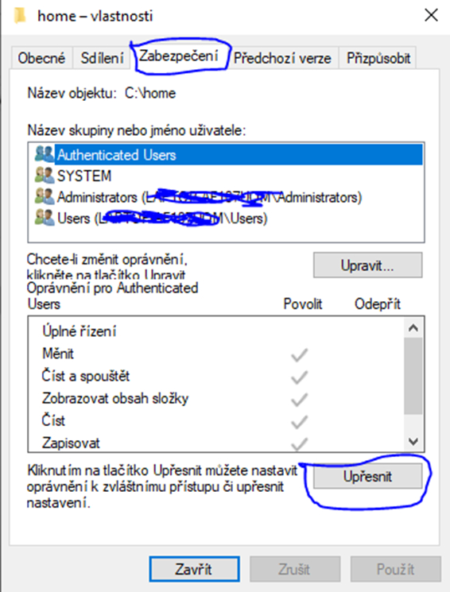
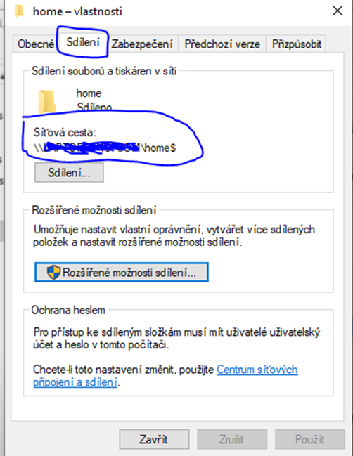
- Pak smazat účty
- A nastavit pro uživatelská práva
- Zabezpečení > Upravit > Přidat > Uživatel
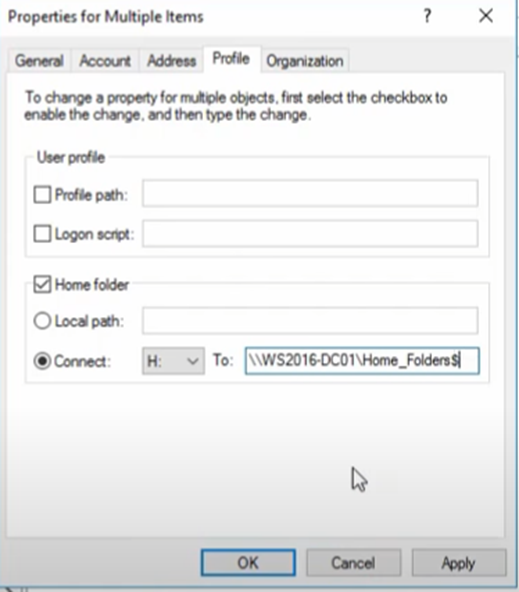
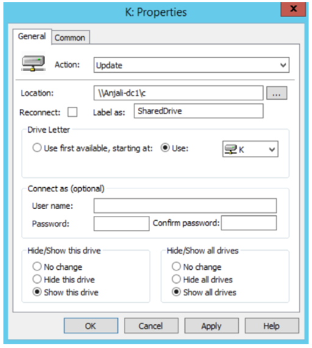
Nastavit jen read u uzivatele
# 6) Nasdílení složky (nějaké společné)
Nasdílení složky a nastavení práv 
````
C:\spolecne 
````
jako společné složky pro domain users pro čtení i zápis


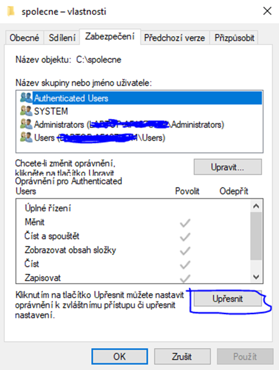
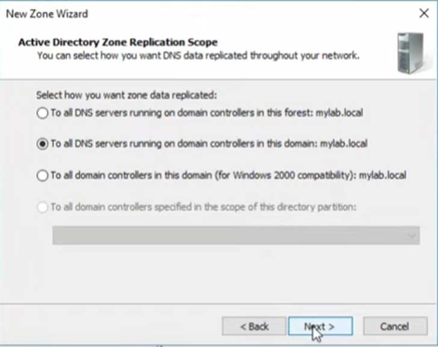
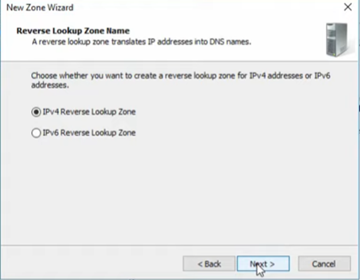
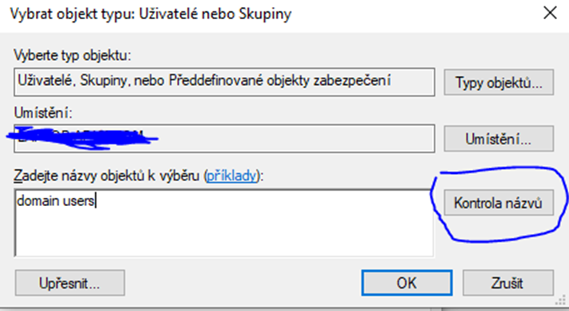
# 7) Mapovaní dříve nakonfiguravaných disků
- Konfigurace mapování home disku H: a společného disku S: pro doménové stanice
## MAPOVÁNÍ HOME disku H: 
Pak zkopírovat **NETWORK PATH/Síťová cesta**:

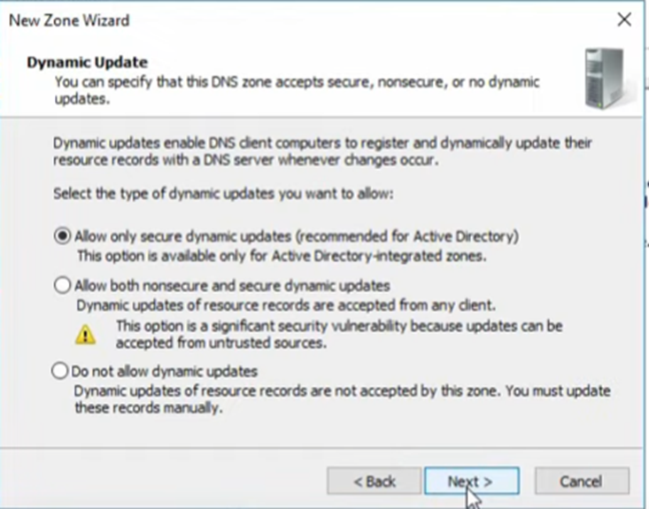
A pak dále v **Active Directory Users and Computers**
Nastavení uživatele
**Profil**
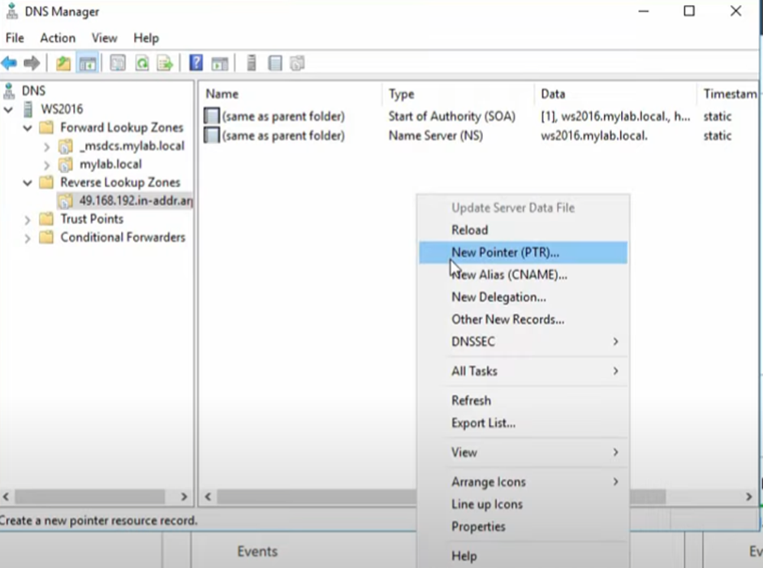
**Home folder**
Connect:
````
H:        \\domena\home$\%username%
````
## MAPOVÁNÍ SPOLECNE na disku S:
- Otevřít Group Policy Management
- Vpravým klikni na Group Policy Objects a dát New  *Název: Map drive S*

- Pak pravým na to kliknout a     edit
- Jít do User Configuration > Preferences > Windows Settings > Drive Maps.
- Vpravým kliknout a vybrat  New > Mapped Drive.
- Under the General tab (see Figure 1 below), do the following:

	Action: **Update**.
	Location: \\\domena\spolecne.
	Reconnect: **ANO**
	Label as: **spolecne.**
	Drive Letter: **S:**
	Connect as: **NIC NEDAVAT**
	Show this drive:
	Show all drives:

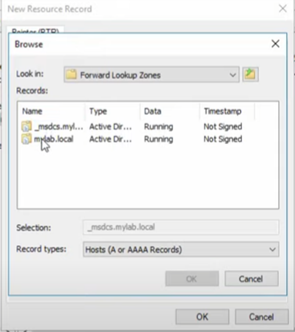
PAK v **GROUP POLICY MANAGEMENT**
Pravým na domenu a kliknout na Link a Existing GPO a Vybrat Map drive S
**Pak v cmd příkaz gpupdate /force**
# 8) Přihlášení stanice do domény, test přihlášení a mapování síťových disků
Pujdes na Win 10
https://www.itechguides.com/join-windows-10-to-domain/
Ujisti se ze nastavujes domenu a ne workgroup, napises tam "eitXX.vspj.cz"
# 9) Konfigurace DHCP serveru
````
Konfigurace DHCP serveru pro internal LAN 10.100.0.0/16, server 10.100.0.1, DHCP rozsah 10.100.0.100 až 10.100.0.200, připojení stanice a ověření konektivity na server
````
## Postup
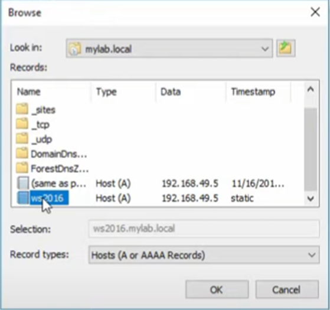
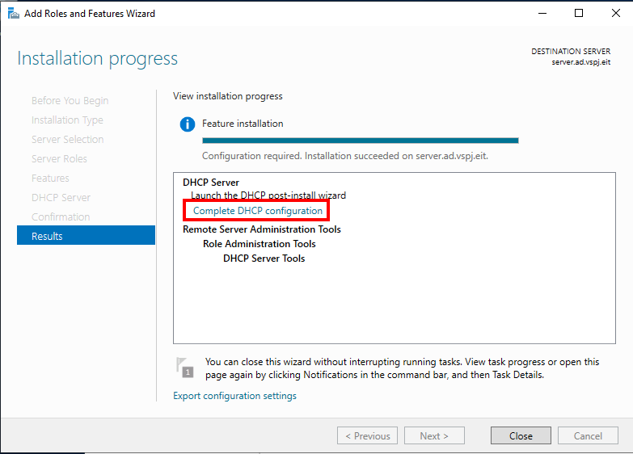
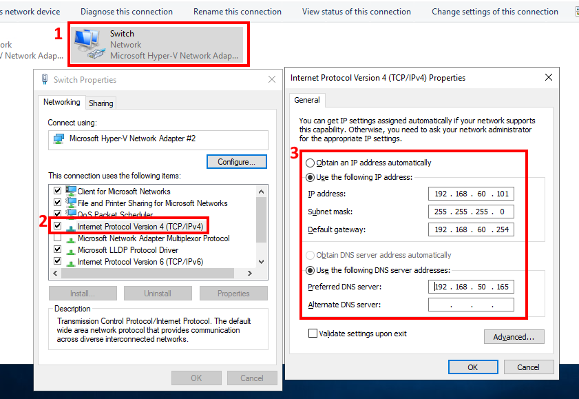
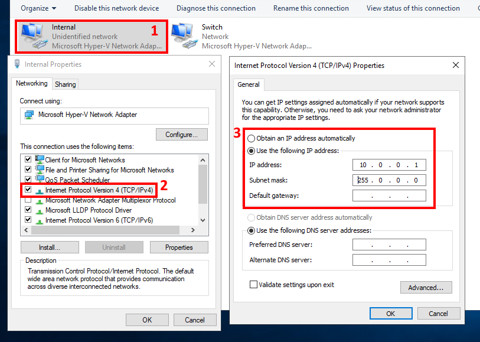
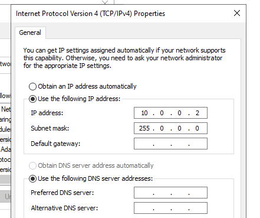
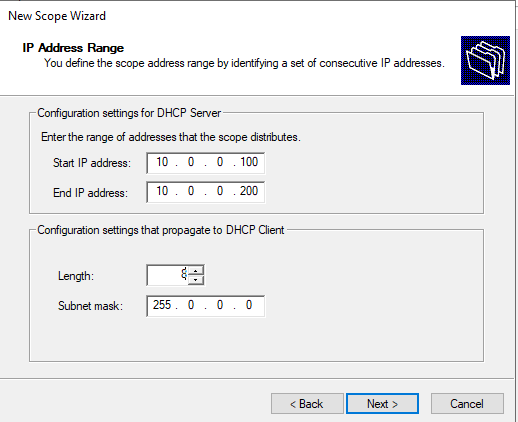

### Klient (Windows 10)
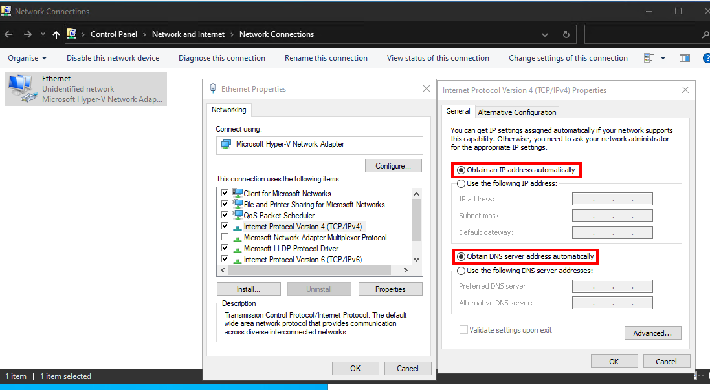
A pak stačí zkontrolovat v CMD
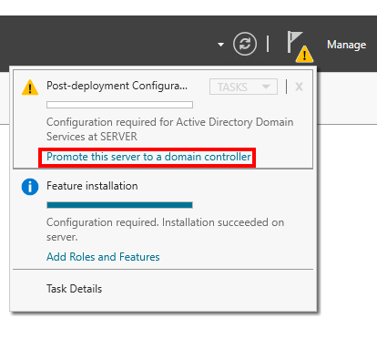
# 10) Instalace ISS
Instalace IIS s podporou ASP, konfigurace ASP skriptu s název index.asp jako výchozího dokumentu webu
````
http://server.kts.vspj.cz/testasp.txt
````

````aspx
<html>
  <head>
    <title>ASP - testovací­ stránka</title>
  </head>
  <body>
    <h1>Ukázka ASP</h1>
    <% for i = 1 to 7 %>
    Radka c. <% = i %>. Obyčejný text.<br>
    <% next %>
    <BR>
    <table>
    <tr>
    <td><b>Server Variable</b></td>
    <td><b>Value</b></td>
    </tr>
    <% For Each name In Request.ServerVariables %>
    <tr>
    <td><% = name %></td>
    <td><% = Request.ServerVariables(name) %></td>
    </tr>
    <% Next %>
    </table>
  </body>
</html>
````


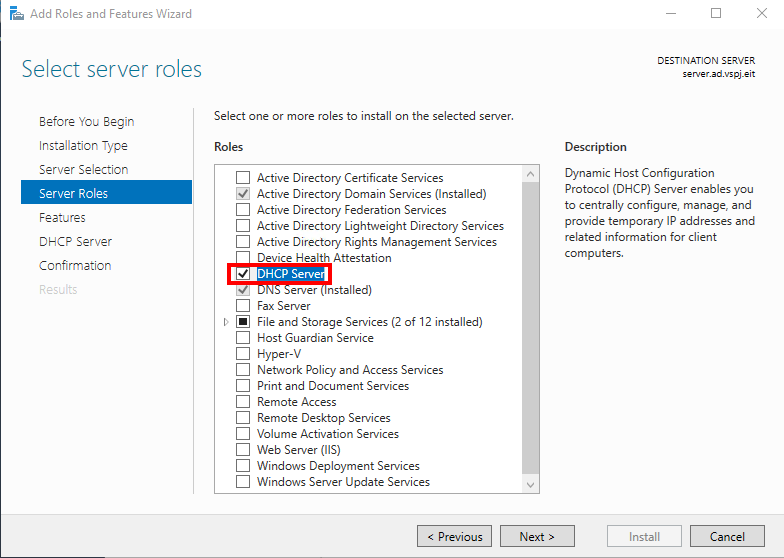
Zde vytvoříme soubor "index.asp" a vložíme tam ten kod co nám byl poskytnut a pak na na adrese "127.0.0.1" můžeme ověřit jestli nám naše stránka funguje

# 11) Konfigurace virtuální webů produkt100.cz
Konfigurace virtuálních webů produkt100.cz (+ www.produkt100.cz) a produkt200.cz (+ www.produkt200.cz) včetně konfigurace A záznamů v DNS

## Nastavená produkt produkt100.cz
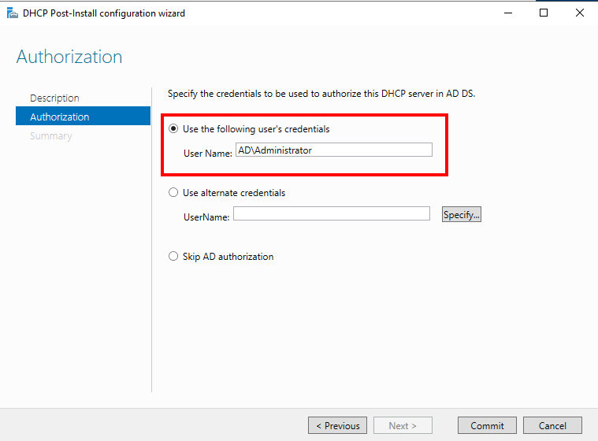
A pak jsem jen šel do DNS udělal jsou novou zonu "produkt100.cz" nastavil jsem všude jen jméno a jinak jsem všude nechal defualtní hodnoty a pak jsem **přidal záznam A**
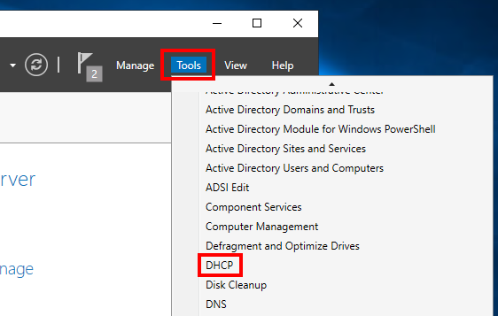
A pro IP address jsem dal IP adresu serveru což v tomto případě je 10.0.0.1
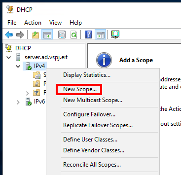
A pak jsem jen zadal do prohlížeče abych otestoval jestli funguje *(ještě potřeba tam vytvořit nějaký dokument v té složce třema index.html a do toho napsat nějaký text)*
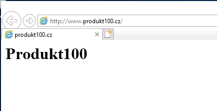
A tohle celé zopakovat jen pro Produkt200.cz
# 12) Windows serveru jako terminálového serveru pro Domain Users
Konfigurace Windows serveru jako terminálového serveru pro domain users včetně lic. serveru, ukázka přihlášení pro u
živatele uzivatel
## Postup
Nainstalujte službu "Remote Desktop Services" na Windows Serveru
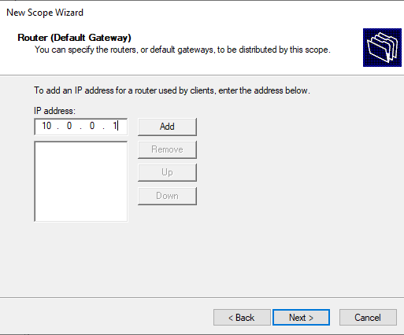
Pridej jeste Remote Desktop Licensing
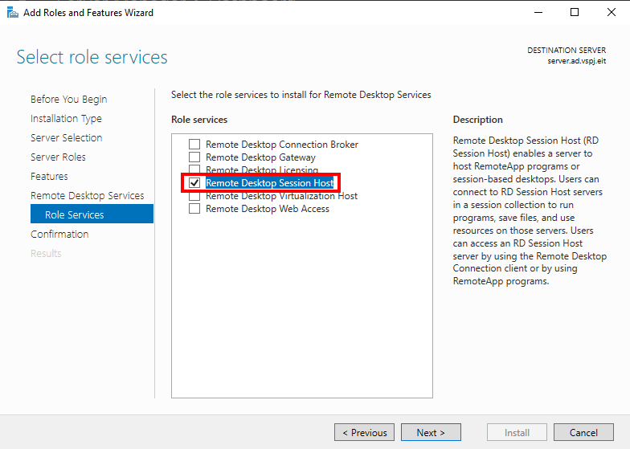
A pak přidáme třeba našeho vytvořeného uživatele do skupiny Remote Desktop Users
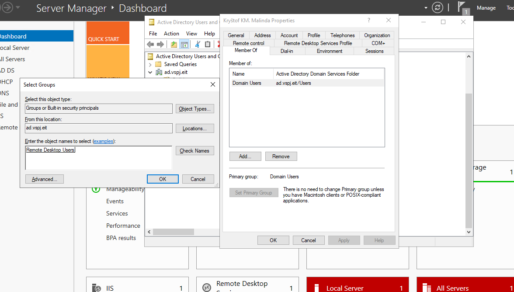
## Ověření spojení
Jdeme na klienta (Windows 10). Vyhledáme aplikace Remote Desktop Connection

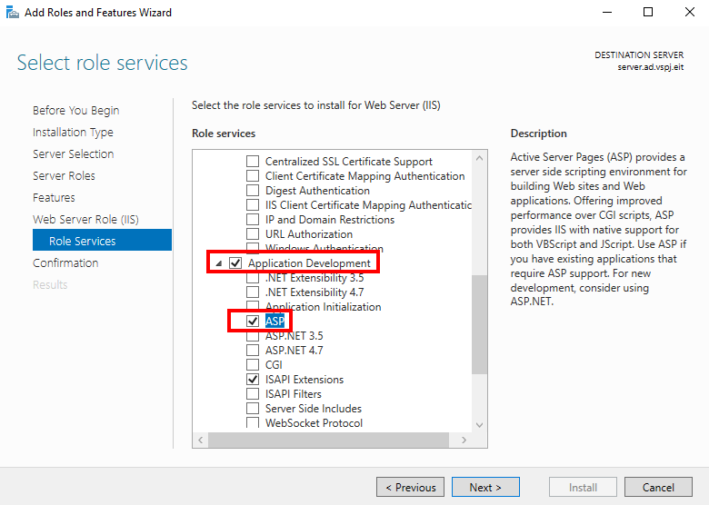
Zadáme IP server a uživatele pod kterým se chceme přihlásit *(Já vybral uživatele Administrator)*

Dáme heslo uživatele
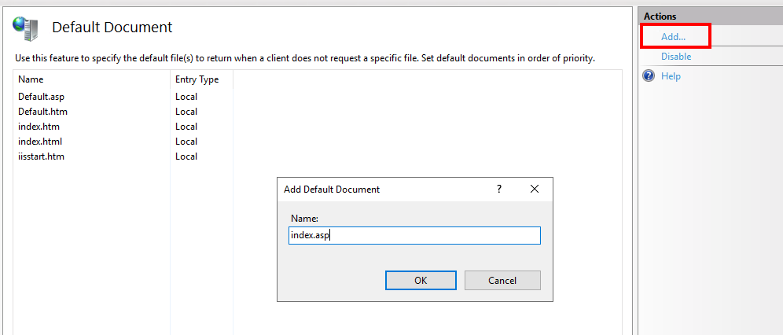
Dáme Yes a mělo by nás to připojit


# 13) Konfigurace Windows serveru jako router 
https://mrigotech.com/windowsserver/win2019/how-to-setup-vpn-using-pptp-on-windows-server-2019/
